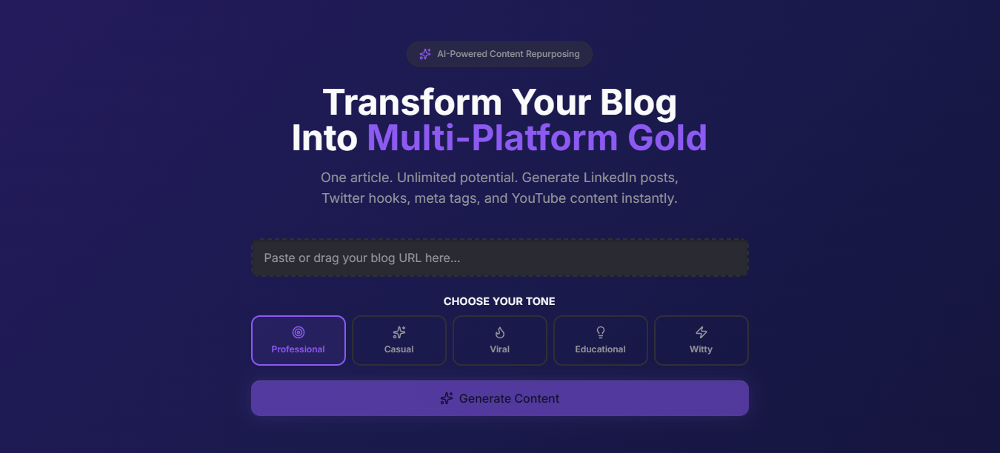

# Remixify 🚀  
## Remixify – AI-Powered Blog Content Repurposer created with vibecoding & some Drinks🥂

Turn one blog post into multiple high-quality marketing assets in seconds.

---

## 📌 Project Overview

Remixify is an AI-powered marketing tool that takes a blog URL, extracts its core content, and automatically generates platform-specific content including:

- 3 LinkedIn post variations (Educational, Controversial, Personal Story)
- 3 Twitter/X hooks
- SEO Meta Title, Description & Keywords
- YouTube Title & Description

The goal was to simulate real-world AI product development: minimal specification, fast execution, clean architecture, and production deployment readiness.

---
## 📸 Homepage Preview




## 🎯 Purpose of the Assessment

This project was designed to evaluate:

- Ability to ship a working product quickly (3–5 hours)
- AI integration and prompt engineering skills
- Handling messy real-world blog extraction
- Clean architecture and separation of concerns
- Error handling maturity
- Deployment readiness (Vercel)
- Debugging real-world production issues

The emphasis was not visual perfection — it was product thinking, architecture clarity, and execution velocity.

---

## 🧠 How It Works

### 1️⃣ URL Input  
User pastes a blog URL into the interface.

---

### 2️⃣ Content Extraction  

We fetch raw HTML using **Axios**, then parse it with:

- `jsdom`
- `@mozilla/readability`

Readability extracts meaningful article text and removes:

- Navigation
- Ads
- Sidebars
- Footer noise

We also:
- Trim and limit content length
- Prevent LLM token overflow

---

### 3️⃣ AI Processing  

The cleaned content is sent to an LLM API (Groq / OpenAI compatible).

Prompt enforces:

- Strict JSON structure
- Human tone
- Platform-specific content variation
- No generic AI phrases
- Valid JSON only

---

### 4️⃣ Defensive Response Handling  

Since LLMs sometimes return:

- Markdown-wrapped JSON (```json)
- Text before JSON
- Slightly malformed structures

We implemented:

- Markdown stripping
- Extract first `{` to last `}`
- Safe JSON parsing
- Graceful fallback on parse errors

---

### 5️⃣ UI Rendering  

Results are displayed in structured sections:

- LinkedIn
- Twitter
- Meta Tags
- YouTube

Features include:

- Copy-to-clipboard buttons
- Loading states
- Error states
- Defensive rendering for missing fields
- Meta normalization (string or object support)

---

## 🛠 Tech Stack

### Frontend
- Next.js (App Router)
- TypeScript
- Tailwind CSS
- Lucide Icons

### Backend (API Route)
- Next.js API Route
- Axios (HTML fetching)
- jsdom
- @mozilla/readability
- OpenAI-compatible API (Groq / OpenAI)

---

## 🏗 Architecture Decisions

### ✔ Separation of Concerns


---

### ✔ Defensive Programming

Handles:

- Missing API key
- Malformed JSON
- Non-200 responses
- Empty LLM responses
- Meta returned as string instead of object
- Network extraction failures

---

### ✔ Production-Ready Fixes

- Moved AI client initialization inside API handler (avoids build crashes)
- Added environment variable validation
- Prevented build-time credential failures on Vercel

---

### ✔ Performance Considerations

- Content capped to avoid token overflow
- No unnecessary re-renders
- Minimal dependencies
- No blocking synchronous operations

---

### ✔ Avoided Over-Engineering

Intentionally excluded:

- Database
- Authentication
- Background workers
- State management libraries
- Over-abstraction

Focus: Ship a functional product fast.

---

## ⏱ Time Log

| Task | Time Spent |
|------|------------|
| Project setup (Next.js + Tailwind) | 30 mins |
| Blog extraction setup | 45 mins |
| AI integration + prompt design | 60 mins |
| JSON parsing & response cleaning | 45 mins |
| Error handling & debugging | 60 mins |
| UI structure + copy buttons | 45 mins |
| Deployment debugging (env vars + build issues) | 45 mins |
| Final polish & testing | 30 mins |

**Total Focused Time: ~4.5–5 hours**

---

## 🧪 Testing Coverage

Tested with:

- WordPress blogs
- Marketing blogs
- Long-form SEO articles
- Content-heavy pages

Verified:

- Extraction success
- AI response reliability
- JSON parsing stability
- Error handling robustness
- Large content handling
- Deployment compatibility

---

## ⚠ Edge Cases Handled

- LLM returning markdown-wrapped JSON
- LLM adding text before JSON
- API returning HTML instead of JSON
- Missing credentials in production
- Network TLS failures
- Meta returned as string
- Unexpected object structures in response

---

## 🧩 What This Project Demonstrates

- Real-world AI product integration  
- Prompt engineering under constraints  
- Handling unpredictable LLM output  
- Clean Next.js App Router structure  
- Defensive backend API logic  
- Production deployment debugging  
- Fast MVP shipping capability  

---

## 🏁 Final Outcome

Remixify successfully converts a single blog into:

- Multi-platform social content  
- SEO-ready metadata  
- YouTube-ready assets  

All in seconds.

Built with speed.  
Engineered for resilience.  
Shipped production-ready.

---
## credits:- om_sonawane 🙏

